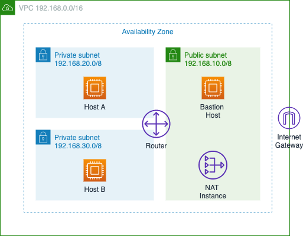

# Activity 07

## VPC Configuration

## Goal
The goal of this activity is to illustrate how to create the following full VPC configuration from scratch. 


 
## Steps

### Step 1 - Create a VPC

Name your VPC "activity_07" and use 192.168.0.0/16 as CIDR block. 

### Step 2 - Create an Internet Gateway 

Create an internet gateway and attach it to the VPC. 

### Step 3 - Create Public Subnet

Name it "pub" and use 192.168.10.0/24 as CIDR block. After the subnet is created, modify auto-assign IP, enabling it. 

### Step 4 - Create Private Subnets 

Name them "priA" and "priB", using 192.168.20.0/24 and 192.168.30.0/24 as CIDR blocks, respectively. Make sure that all subnets are in the same AZ. 

### Step 5 - Launch Bastion Host Instance 

Launch an EC2 instance in the public subnet. Put the instance into a new security group named "sgpub", allowing ssh access from the internet. 

### Step 6 - Configure the Route Table for the Public Subnet 

When you VPC was created, a route table was automatically created with one default local route.  Associate this route table to the public subnet and create a default route redirecting traffic to the internet gateway. 

### Step 7 - Test ssh to Bastion Host 

At this point you should be able to ssh to the bastion host instance. Before you do that, add the cs39ab.pem key to your ssh location configuration to allow ssh agent forwarding. 

```
ssh-add -K cs39ab.pem (macos)
ssh-add -c cs39ab.pem (linux)
```

Now ssh to the bastion host using: 

```
ssh -A ec2-user@<public-IP of bastion host>
```

### Step 8 - Launch EC2 Instances in Private Subnets

Put the instances into a new security group named "sgpri", allowing ssh access from the security group "sgpub". 

### Step 9 - Configure the Route Table for the Private Subnets

Create a new route table and have it associated to both private subnets. At this point you should be able to ssh to any of the EC2 instances in the private subnets from the bastion host instance. However, internet access should not work. Try it yourself: 

```
curl www.google.com
```

### Step 10 - Adding a NAT Gateway 

Create a NAT gateway in the public subnet. After the NAT gateway is up and running, add a default route in the private route configurations forwarding traffic to the NAT gateway. Internet access from the EC2 instances should work now. 