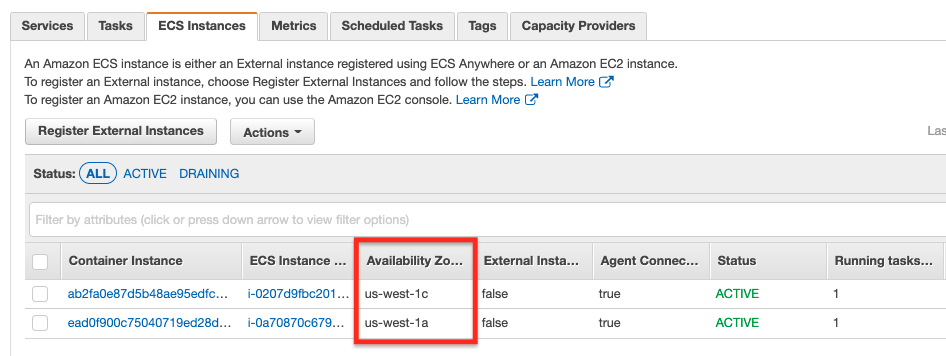

# Activity 20

## An Docker-based Application deployed in 2 AZs w/ ALB

## Instructions
Repeat activity #15, but this time build your cluster with 2 ECS instances, each on a different AZ for high availability. Different that activity #15, it is OK to create just 1 task definition (with 2 port mappings: 3000:8000 and 3001:8001) this time. 
When you are done, create 2 tasks from the task definition. What is interesting to look in this activity is the "Task Placement" option. Choose the default strategy which is the "AZ Balanced Spread" placement. After the 2 tasks are launched, you should have 4 containers running, 2 on ports 3000/3001 on each ECS instance. 

Don't forget to create the ALB and register all ECS instances (with ports) as targets. Test you application and simulate one of the ECS instances becoming irresponsive (by stoping one of the tasks). 

