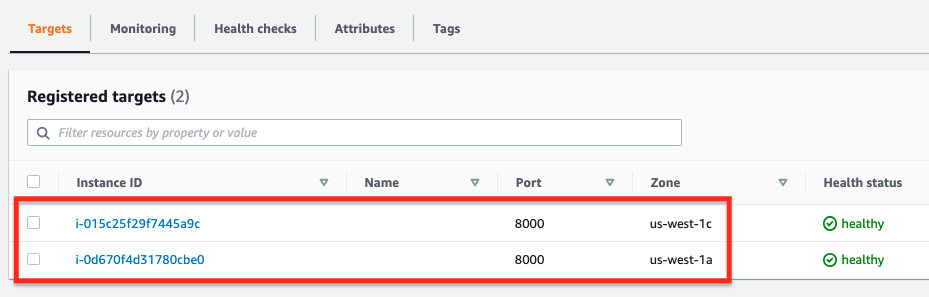
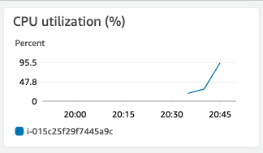
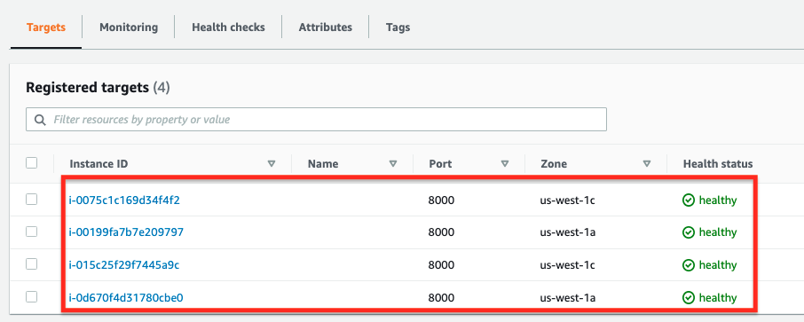
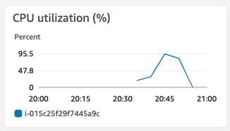
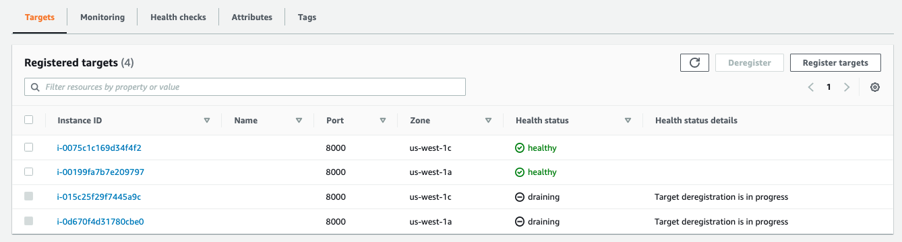

# Activity 21

## An EC2-based Application w/ Auto Scaling + ALB

## Instructions
Repeat activity #14 but do NOT register any targets. Configure auto scaling so more instances are automatically launched when workload increases, and instances are shutdown when workload gets back to normal. 

### Step 0 - Create a Launch Configuration

Begin by creating a launch configuration (or template) using the following parameters:

* Name: activity21
* AMI: ami-0ed05376b59b90e46 (that's the Amazon Linux 2 AMI)
* Instance type: t2.micro
* Security group: activity21 (ports 22, 80, and 8000 open to anywhere)
* Key pair: cs39ab
* Advanced detail (kinda of hidden):
    * user data (use the following)

```
#!/bin/bash
sudo mkdir /home/ec2-user/hello
sudo wget https://scissors-sinners.s3-us-west-1.amazonaws.com/hello.py -P /home/ec2-user/hello
sudo chown -R ec2-user /home/ec2-user/hello
sudo wget https://scissors-sinners.s3-us-west-1.amazonaws.com/hello.service -P /etc/systemd/system
sudo systemctl enable hello; systemctl start hello
sudo amazon-linux-extras install epel -y
sudo yum install stress -y
```

Then create an auto scaling group following the steps:

### Step 1: Choose launch template or configuration

* Auto Scaling Group Name: activity21
* Launch Configuration (or template): activity 21 

### Step 2: Configure Settings 

* VPC: default
* Subnet: select all subnets (make sure public IPv4 is enabled on all subnets by default)

### Step 3: Load Balancer 

Use the ALB created previously

### Step 4: Configure group size and scaling policies

* Desired capacity: 2
* Minimum capacity: 1
* Maximum capacity: 4 
* Scaling Policy: Target tracking
    * Name: activity21
    * Metric type: cpu utilization 
    * Target value: 50

### Step 5 - Add notifications (skip)

### Step 6 - Add tags (skip)

### Step 7 - Review 

## Testing 

Once your auto scaling group is created, go to target groups. You should be able to see 2 instances already registered and in the process of being healthy. 



Remember, the auto scaling group set 2 as the desired capacity. Using the load balancer endpoint, test your application. 

To test the auto scaling, ssh to one of the EC2 instances. Then issue the following command to add an artifical CPU load to the instance and trigger launching a new instance automatically. 

```
stress --cpu 16
```

After that command is issued (which spawns 16 worker threads performing square root computations), refresh the target group info and verify if another instance was launched. It may take up to 5 minutes for the CPU utilization reach more than 50%. 





Finally, let's make sure the system scales in by cancelling the stress run. 




