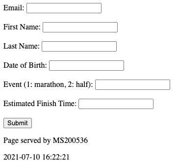
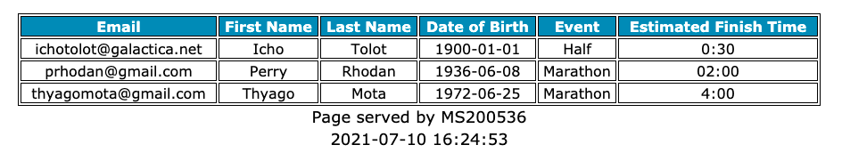

# Lab 02

## The Perry Rhodan Annual Marathon

## Goal
You were hired to implement the registration website for the new Perry Rhodan Marathon.  The organizers of the event are expecting many users to visit the website when first launched.  Your web app should run on a minimum of 2 EC2 instances in distinct AZs (for higher availability) and be accessed through a load balancer. 
 
## Backend

You should save the following registration information in a database: 

* email (primary key)
* first name
* last name
* date of birth
* event (1: marathon, 2: half-marathon)
* estimated finish time

The sql for this database is given to you (under files). The database must run on AWS RDS service. The webapp should get db connection parameters using environment varaibles. An easy way to set environment variables is in the service definition file (see example below). 

```
Environment=DB_HOST=<replace with the host dns name>
Environment=DB_NAME=perryrhodan
Environment=DB_USER=perryrhodan
Environment=DB_PASSWORD=135791
```

## Frontend

Your webapp should display a form allowing users to enter their registration information. If the email is already registered, you webapp should display an informative (error) message. I am not expecting anything fancy (just basic functionality). Below is how my form looks like (no css). 



The path "/admin" should display a list with all of the registered participants. Don't worry about authentication or the fact that this path is open for public use. 



To verify if the load balancing is working, your app should display on the bottom of all pages the hostname that served the page. 

Take a look at the given perryrhodan.py initial code, which uses a similar webapp framework to the one used in class. 

Hint: to install Python's MySQL connector (used by perryrhodan.py) you can add the following line in your user-data.sh file: 

```
pip3 install mysql-connector
```

## Deliverables 

If you are using the same framework used in class, you need to submit the following files: 

* perryrhodan.py (your webapp source code)
* perryrhodan.service
* user-data.sh (all of the necessary files need to be downloaded from a pre-configured s3 bucket)

If you want to use your own web framework, just zip all of the files required for me to reproduce your solution.  Please, if you decide to go on that route, you need to give me detailed instructions on how to deploy your webapp in an EC2 instance. 

You should also share with me the DNS hostname of your webapp (load balancer entry point) so I can check your webapp remotely. 

## Rubric

* \+30 webapp
    * \+10 basic registration works as expected
    * \+5 displays an error if user is already registered
    * \+10 admin page showing all registered users
    * \+5 app gets db connection parameters using environment variables
* \+20 database runs on AWS RDS service and works as expected
* \+20 load balancer works as expected (needs to display the hostname at the bootom of ALL pages)
* \+15 service script (automatically starts the application when an instance starts)
* \+15 user-data.sh
    * \+10 does all of the necessary configurations for an ec2 instance to be able to run the webapp
    * \+5 script gets required files (including the webapp) from a pre-configured s3 bucket
* \-5 team members are not identified 
* \-5 zip format wasn't used